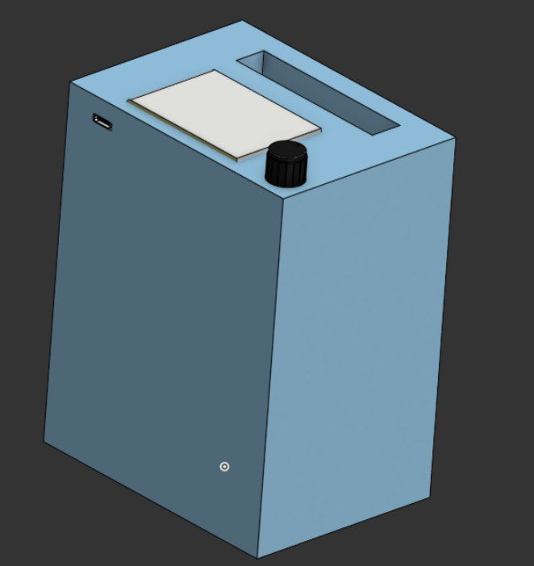
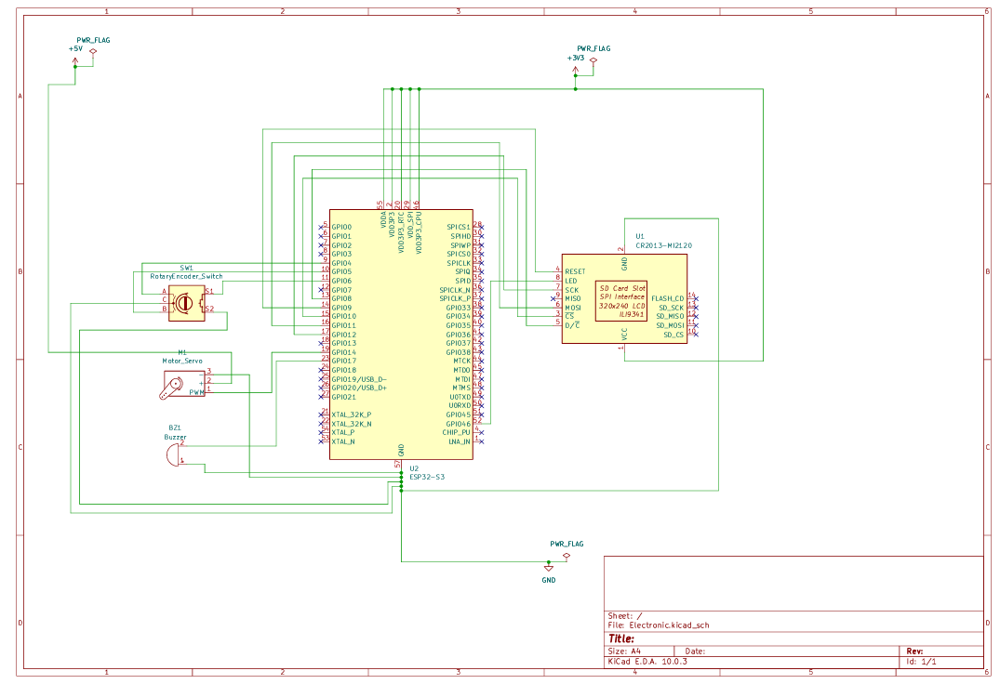
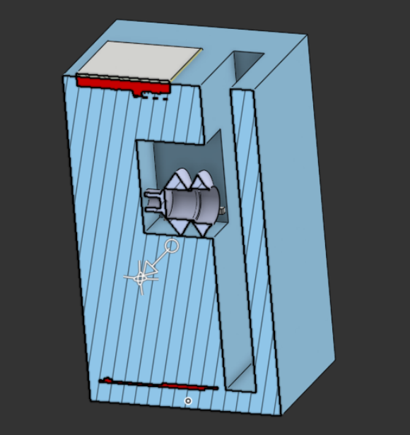
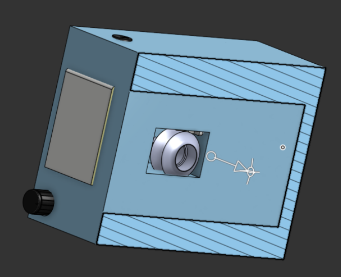

# Pomodoro Lockbox
A focus timer that physically locks away your phone for the session 
duration and releases it when the session completes.

## How it works
It has an ESP32-S3 as a the microcontroller and a KY-040 rotary encoder which is used to set the time and lock the phone by clicking it. It also has a Oled-display to show the time and a buzzer to notify the user. The phone is locked using a servo attached to a vaccum suction cup. 

## Why I built it
We all have time limiting apps on our phone but we always find a workaround. So i built a physical device that holds the phone physically out of reach so I can get your work done.

## Usage
1. Power on the device with the switch on the side
2. Rotate the encoder to set session duration (5-60 min)
3. Place your phone inside, close the door
4. Press the encoder to start
5. [...continue with all the actual interactions]

## Hardware
- BOM with total cost: see [bom/bom.csv](bom/bom.csv)
- Schematic: see [electronics/schematic.pdf](electronics/schematic.pdf)
- 

## CAD
- Onshape (live): [link]
- STEP files: [cad/step/](cad/step/)
- Source: [cad/source/](cad/source/)

## Firmware
The firmware runs on an ESP32-S3 using TFT_eSPI for the display 
and the Servo library for the latch.

### Flashing
1. Install PlatformIO or Arduino IDE
2. Install libraries: TFT_eSPI, ESP32Servo
3. Configure `User_Setup.h` for the ILI9341
4. Select board: ESP32-S3 Dev Module
5. Compile and upload

Pin map: see [firmware/pinmap.md](firmware/pinmap.md)

## Replication
### Step 1 - Order the Components
Order all the components listed in the BOM

---

### Step 2 - Solder and Populate
Populate the core components, motor driver, connectors, and sensor headers.

---

### Step 3 - Flash the Firmware
Flash according to the Flashing guide above

---

### Step 4 - 3D Print
- **Material:** PLA works well.3d print the enclosure. **ALSO CHANGE THE DIMENSIONS TO SUIT YOUR PHONE SIZE**

---

### Step 5 - Final Assembly
Mount the components in the case, wire the servo and power, and connect sensors.

---

## License
MIT
